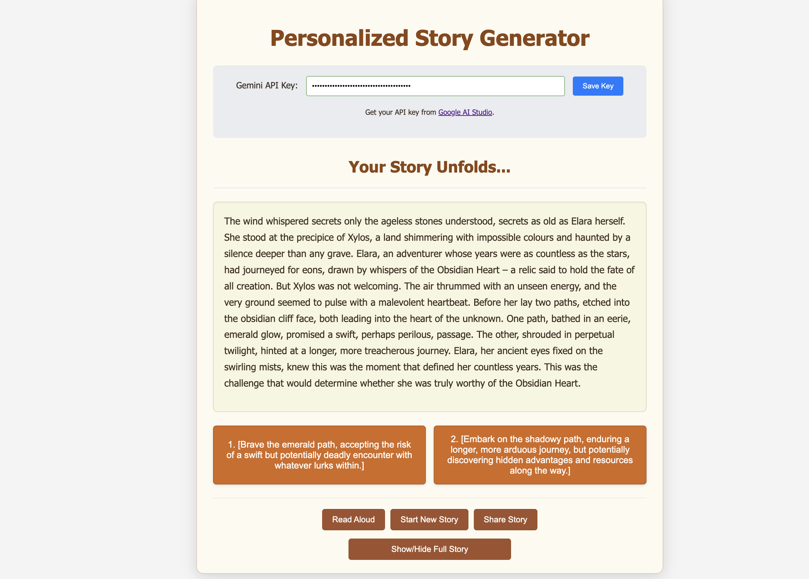

# Personalized Story Generator (AI-Powered)

Welcome to the AI-Powered Personalized Story Generator! This web application allows users to create unique, modular, and highly customizable stories. It uses the Google Gemini API to generate dynamic and coherent narratives that you can save, export, and share.

You can access here: [website](https://fireemblem59.github.io/personalized-story-generator/)

<picture>
<source srcset="image.png">

</picture>

## Features

- **Progressive Disclosure UI:** A clean, user-friendly interface with collapsible sections that keeps the screen uncluttered for new users while offering deep customization for advanced users.
- **Inspiration Boosters:** "Randomizer" buttons for key creative fields (names, locations, conflicts) to help overcome writer's block.
- **Dynamic Story Length:** Choose between a "Short Story" with a fixed length or a "Novel" with extended turns.
- **Dynamic AI Generation:** Leverages the Google Gemini API (gemini-1.5-flash model) to craft story segments.
- **User-Driven Narratives:** Make choices from AI-generated options or write your own custom action to steer the story.
- **Complete Story Library:** Save your stories to your browser and access them from a dedicated, beautifully organized library page.
- **Advanced Export Options:** Save your finished stories as .txt, .pdf, or even .epub files for e-readers.
- **Themed UI:** The application's background and accents change based on the selected story genre (Fantasy, Sci-Fi, etc.).
- **Text-to-Speech:** Listen to your generated story read aloud by the browser.

## Tech Stack

- **Frontend:** HTML5, CSS3, Vanilla JavaScript (ES Modules)
- **AI Integration:** Google Gemini API (via `@google/generative-ai` SDK)
- **Export Libraries:** jsPDF, JSZip, and FileSaver.js
- **Text-to-Speech:** Browser's built-in `SpeechSynthesis` API

## Setup and Usage

To run this project locally, you'll need a Google Gemini API Key.

**1. Get a Gemini API Key:**

- Visit [Google AI Studio](https://aistudio.google.com/app/apikey) and create an API key.

**2. Clone the Repository (or Download Files):**

- **Option A (Clone):**
  ```bash
  git clone https://github.com/FireEmblem59/personalized-story-generator.git
  cd personalized-story-generator
  ```
- **Option B (Download ZIP):**
  - If you downloaded the project as a ZIP file from GitHub, extract it to a folder on your computer.
  - Open your terminal or command prompt and navigate into this extracted folder.

**3. Run the Application via a Local Web Server:**

This project uses ES Modules and makes API calls, which require it to be served via a web server (not by directly opening `index.html` with `file:///`).

- **Using VS Code Live Server (Recommended for ease of use):**

  1.  If you have Visual Studio Code, install the "Live Server" extension by Ritwick Dey.
  2.  Open the project folder (`personalized-story-generator`) in VS Code.
  3.  Right-click on the `index.html` file in the VS Code explorer panel.
  4.  Select "Open with Live Server". This will automatically open the application in your default web browser.

- **Using Python's built-in HTTP server:**

  1.  Ensure you have Python installed.
  2.  Open your terminal or command prompt.
  3.  Navigate to the root directory of the project (where `index.html` is located).
  4.  If you have Python 3, run: `python -m http.server`
  5.  If you have Python 2 (older systems), run: `python -m SimpleHTTPServer`
  6.  The terminal will display a message like `Serving HTTP on 0.0.0.0 port 8000 (http://0.0.0.0:8000/) ...`.
  7.  Open your web browser and go to `http://localhost:8000`.

**4. Configure API Key:**

- Once the application is running, you will be prompted to enter your Gemini API Key.
- Paste your key and click "Save Key". It will be stored in your browser's localStorage for future sessions.

**5. Create Your Story:**

- Use the main input fields to set up your story. Click the 🎲 buttons for inspiration!.
- Expand the collapsible sections to add more detail.
- Click "Start My Story!" and interact with the choices to continue the narrative.
- Use the control buttons to read aloud, restart, or share/export your story.
- Visit the "Story Library" to view, load, or delete your saved creations.

## How It Works

The application constructs prompts based on user inputs (protagonist, setting, conflict, template, etc.) and the current story state (previous story parts and choices made). These prompts are sent to the Google Gemini API. The API processes the prompt and returns a new story segment, typically ending with two distinct choices for the protagonist. The user's selected choice is then used to build the context for the next API call, allowing the narrative to branch and evolve dynamically.

## Future Enhancements

This list tracks the project's direction and features that are planned or in progress

- ~~Refactor code into a modular structure (UI, API, State, etc.).~~
- ~~Create a clean UI with collapsible sections for advanced options~~
- ~~Implement a "Story Library" to view and manage saved stories.~~
- ~~Add randomizer buttons for key inputs to spark creativity.~~
- Implement AI-generated images for scenes or characters.
- A backend system for saving and loading stories, allowing users to resume or share persistent story links.
- User accounts and a public or private gallery for users to save and share their favorite generated stories.
- More advanced character customization options, perhaps with AI-generated personality descriptions based on traits.
- ~~Support for more than two choices at decision points.~~

## Contributing

Contributions are welcome! If you have ideas for improvements, find bugs, or want to add new features, please feel free to:

1.  Fork the repository on GitHub.
2.  Create a new branch for your feature or bugfix (`git checkout -b feature/YourAmazingFeature` or `git checkout -b fix/IssueDescription`).
3.  Make your changes and commit them with clear, descriptive messages (`git commit -m 'Add some AmazingFeature'`).
4.  Push your changes to your forked repository (`git push origin feature/YourAmazingFeature`).
5.  Open a Pull Request against the main repository, explaining your changes.

## License

This project is licensed under the MIT License - see the `LICENSE` file for details.
